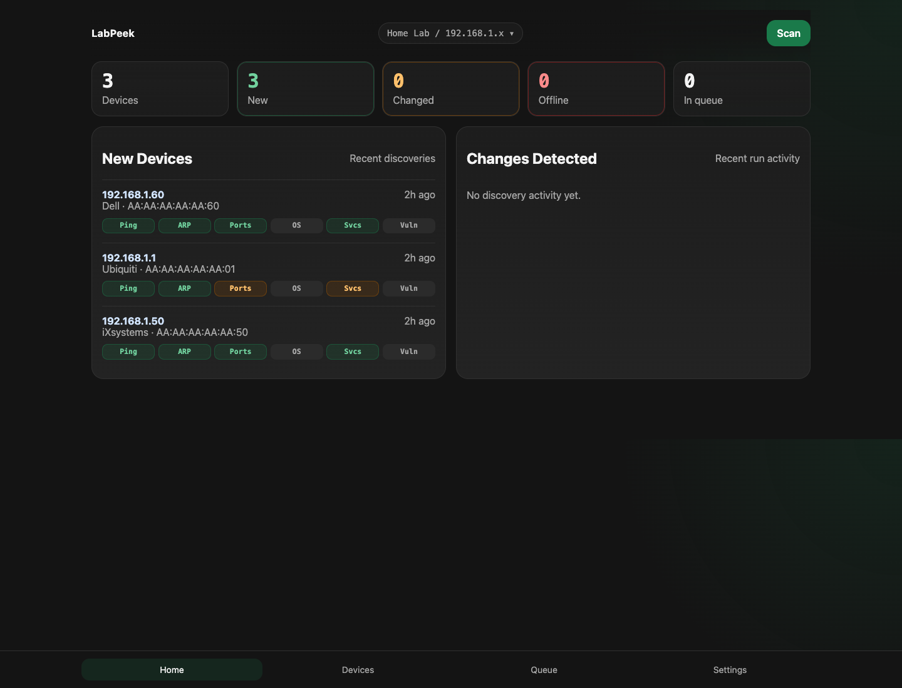
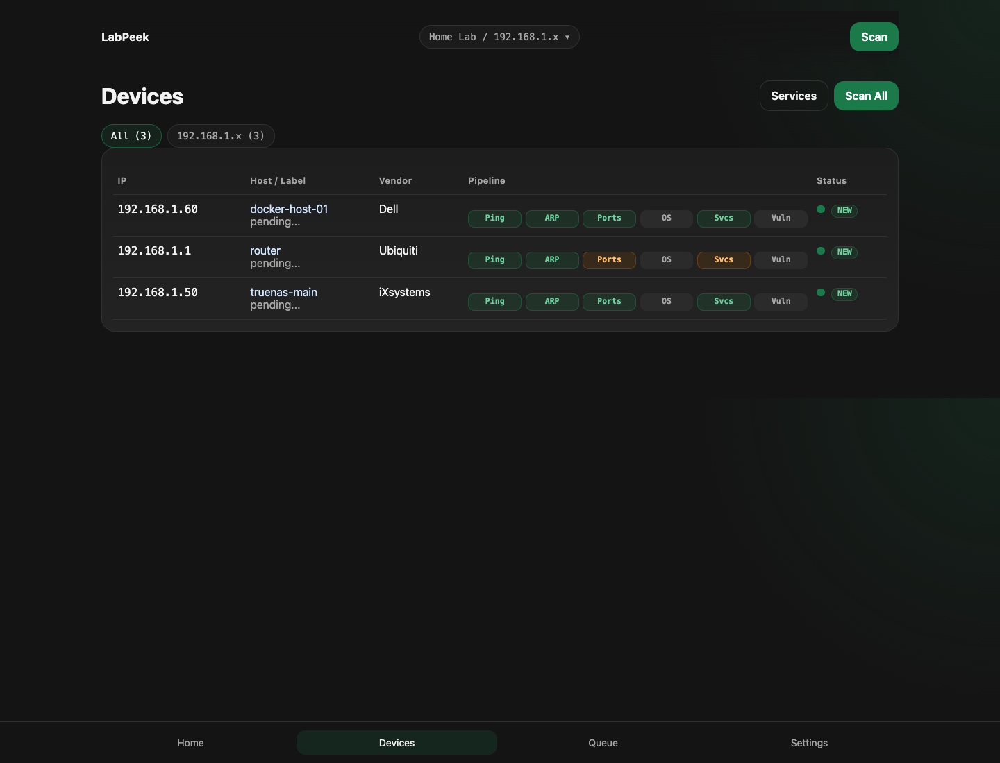
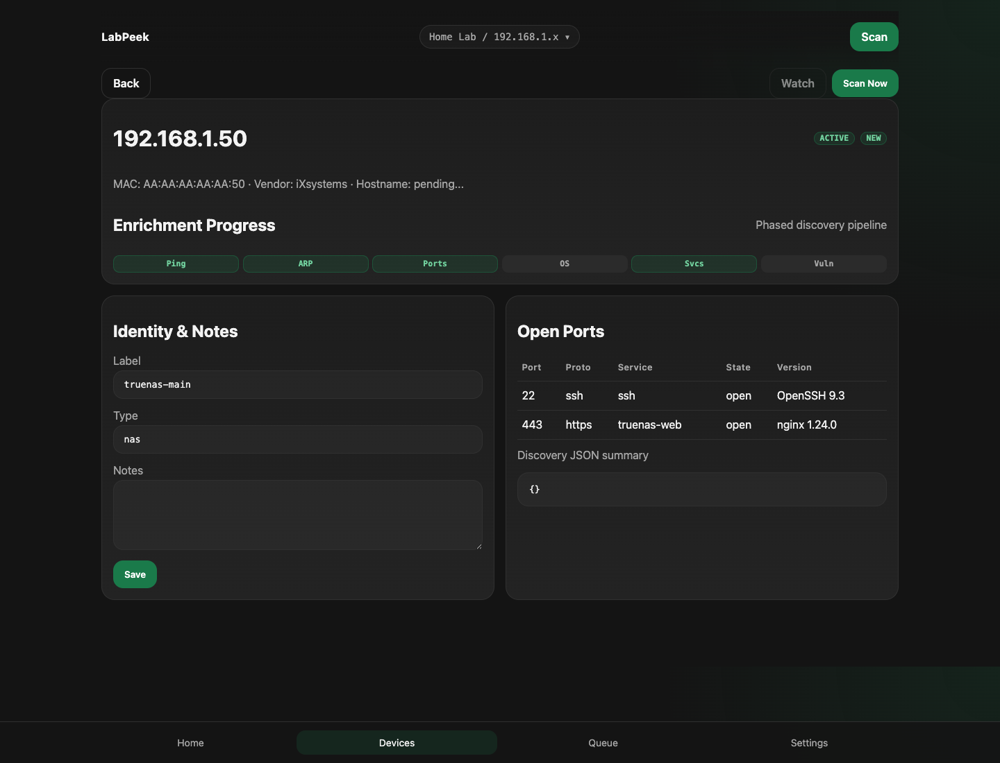
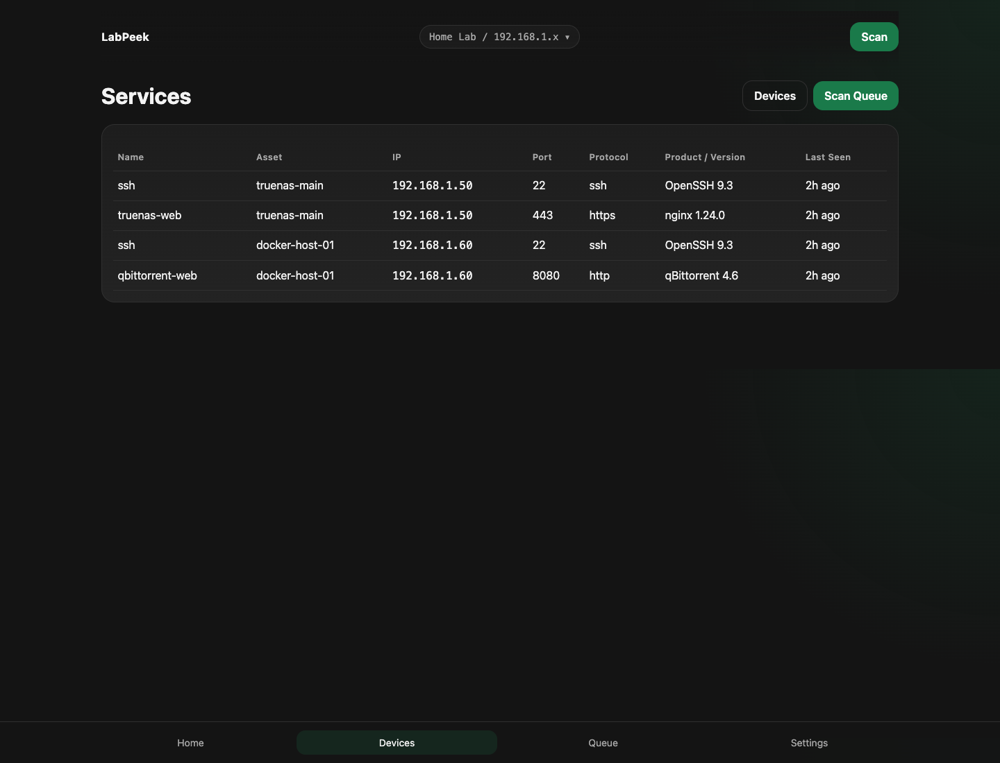
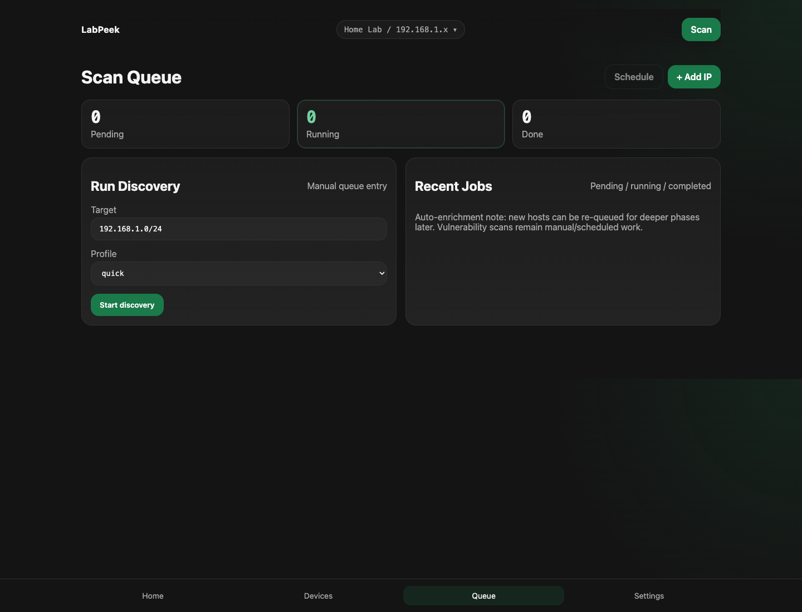
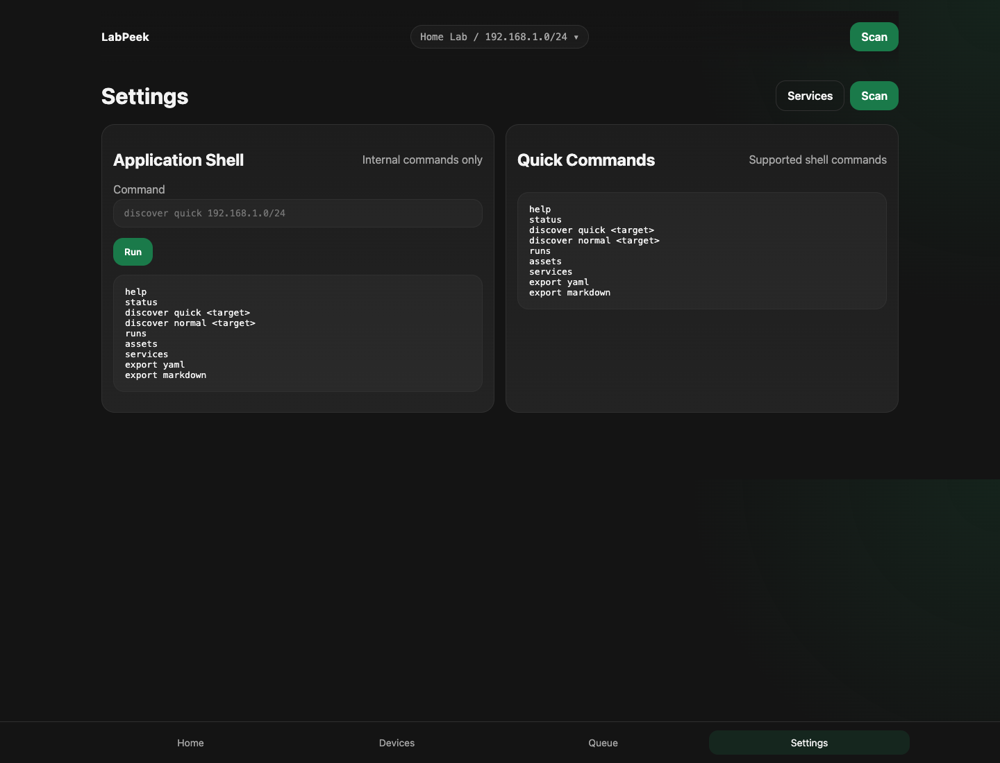

# LabPeek

LabPeek is a self-hosted home-lab CMDB and network discovery tool built with Go, SQLite, and a simple server-rendered UI. It is designed for single-binary deployment, Docker Compose, and small self-hosted environments such as TrueNAS SCALE custom apps.

## Current Status

The current MVP includes:

- SQLite migrations and sensible startup PRAGMAs
- dashboard, devices, device detail, services, discovery queue, and application shell pages
- asset and service repositories
- manual asset rename/type/notes editing
- nmap XML parsing and discovery import
- discovery run history
- YAML and Markdown export

Discovery and curated CMDB data are kept separate. Manual fields such as `display_name` and `asset_type` are preserved across rediscovery.

## Screenshots








Screenshots are stored under `docs/screenshots/`.

## Features

- Go backend, SQLite only, single local data directory
- dark server-rendered UI with no React/Vue/Svelte frontend
- assets and services inventory pages
- device detail page with manual editing
- discovery queue and run history
- application shell with internal commands only
- labeled nmap-driven discovery from the UI or CLI
- raw XML discovery output stored as files under `./data/discovery/`
- YAML and Markdown export

## What It Does Not Do Yet

- authentication or multi-user workflows
- scheduled/background discovery orchestration
- advanced reconciliation suggestions for ambiguous IP-only matches
- polished reporting/export beyond the initial YAML and Markdown outputs

## Quick Start: Local

Run tests:

```bash
make test
```

Start the app:

```bash
make run
```

Open:

```text
http://localhost:8080
```

Optional demo seed for local screenshots/testing:

```bash
go run ./cmd/labpeek seed-demo
```

If you want to run discovery locally, install `nmap` on the host first. If `nmap` is missing, LabPeek fails the run cleanly and records the error instead of crashing.

## Quick Start: Docker

Build and start:

```bash
docker compose up --build
```

Then open:

```text
http://localhost:8088
```

On older Docker installs, use `docker-compose up --build` instead.

The container image includes `nmap`.

## First Discovery

From the UI:

1. Open `/discovery`
2. Enter a target such as `192.168.1.0/24`
3. Choose `Network ping sweep (quick)` or `Service scan on running devices (normal)`
4. Start discovery

The request returns immediately and the run continues in the background. You can move around the UI while the queue page updates state.

From the CLI:

```bash
go run ./cmd/labpeek discover --profile quick --target 192.168.1.0/24
go run ./cmd/labpeek discover --profile normal --target 192.168.1.0/24
```

Discovery targets are validated. Public IP ranges are blocked by default unless `LABPEEK_ALLOW_PUBLIC_SCAN=true`.

## Web Shell Commands

The `/shell` page is an application shell, not an OS shell. Supported commands:

```text
help
status
discover quick <target>
discover normal <target>
runs
assets
services
export yaml
export markdown
```

## SQLite Database and Backup

Default paths:

- database: `./data/labpeek.db`
- raw discovery XML: `./data/discovery/`
- export output: wherever you choose, commonly `./data/exports/`

Cold backup:

```bash
docker compose stop
cp ./data/labpeek.db ./data/labpeek.db.bak
docker compose start
```

Or back up the whole `./data/` directory.

## TrueNAS SCALE Deployment

### Docker Hub

The image is published to Docker Hub:

```
docker pull labpeek/labpeek:latest
```

### Quick `docker run`

```bash
docker run -d \
  --name labpeek \
  --cap-add NET_RAW \
  --cap-add NET_ADMIN \
  -p 8088:8080 \
  -v /mnt/tank/labpeek/data:/app/data \
  --restart unless-stopped \
  labpeek/labpeek:latest
```

Open `http://<your-truenas-ip>:8088`.

Replace `/mnt/tank/labpeek/data` with the path to your TrueNAS dataset. Create the dataset before starting the container.

### TrueNAS SCALE Custom App

In TrueNAS SCALE → **Apps** → **Discover** → **Custom App**, paste this Compose YAML:

```yaml
version: "3"
services:
  labpeek:
    image: labpeek/labpeek:latest
    container_name: labpeek
    restart: unless-stopped
    cap_add:
      - NET_RAW
      - NET_ADMIN
    ports:
      - "8088:8080"
    volumes:
      - /mnt/tank/labpeek/data:/app/data
    environment:
      LABPEEK_ADDR: ":8080"
      LABPEEK_DB: "/app/data/labpeek.db"
      LABPEEK_DATA_DIR: "/app/data"
      LABPEEK_APP_NAME: "LabPeek"
```

### Notes

- `NET_RAW` and `NET_ADMIN` are required for nmap ping sweeps inside the container. Without them, only TCP connect scans work.
- `privileged: true` is **not** required and should not be used.
- For nmap to see all subnets on your TrueNAS network add `network_mode: host` to the service. Without it, discovery is limited to the Docker bridge subnet.
- Back up by snapshotting or copying the dataset directory. The SQLite database is at `/app/data/labpeek.db`.
- Mount the **directory** (`/app/data`), not the file directly.
- Start with `Network ping sweep (quick)` before trying heavier profiles on large networks.

## Configuration

| Variable | Default | Description |
|---|---|---|
| `LABPEEK_ADDR` | `:8080` | HTTP listen address |
| `LABPEEK_DB` | `./data/labpeek.db` | SQLite database path |
| `LABPEEK_DATA_DIR` | `./data` | App data directory |
| `LABPEEK_APP_NAME` | `LabPeek` | UI and server name |
| `LABPEEK_ALLOW_PUBLIC_SCAN` | `false` | Allow public discovery targets |

See [.env.example](.env.example).

## Discovery Profiles

- `Network ping sweep (quick)`: `nmap -sn -oX <file> <target>`
- `Service scan on running devices (normal)`: `nmap -sV --top-ports 100 -oX <file> <target>`
- `Slow safe service scan`: `nmap -sV --top-ports 100 --scan-delay 100ms --max-rate 50 -oX <file> <target>`
- `Deep full-port and OS scan`: `nmap -sV -O -p- --max-retries 3 -oX <file> <target>`

The UI exposes all four labels above. The CLI still uses the profile keys `quick`, `normal`, `slow-safe`, and `deep`.

## Safety Notes

- raw discovery XML is stored as files, not large blobs in SQLite
- manual CMDB fields are not overwritten by discovery
- services are upserted by `ip_address + port + protocol + transport`
- public network targets are blocked by default

## Development Commands

```bash
make test
make build
make run
go run ./cmd/labpeek migrate
go run ./cmd/labpeek seed-demo
go run ./cmd/labpeek export yaml --output inventory.yaml
go run ./cmd/labpeek export markdown --output inventory.md
```

## Roadmap

- richer asset/service filtering and reconciliation views
- more complete discovery run detail and logs UI
- deeper reconciliation safeguards for ambiguous matches
- improved reporting and export formats
